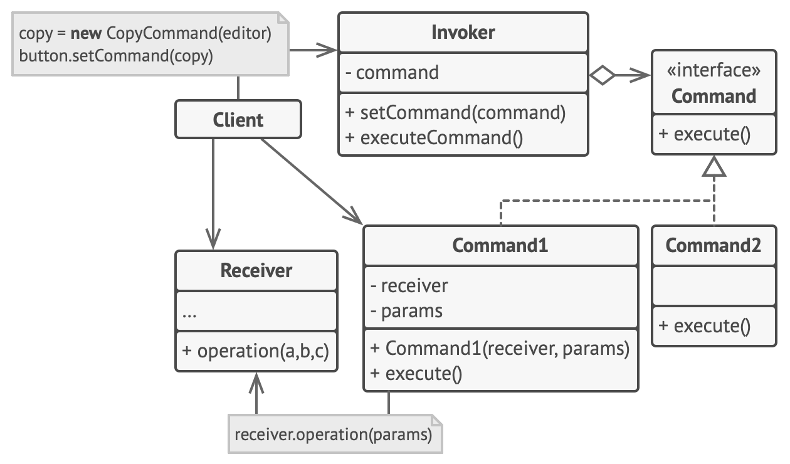

# Design Pattern - Command

Transforma um pedido em um objeto independente que contém toda a informação sobre o pedido. 

Essa transformação permite que você parametrize métodos com diferentes pedidos, atrase ou coloque a execução do pedido em uma fila, e suporte operações que não podem ser feitas.

O comando é uma estatégia para se chamar um método execute, no qual a classe contenha todos os dados para executar este comando.

## Diagrama

## Exemplo:

- `EditorTexto` representa nossa classe Receiver/Destinatário, onde o comando irá executar algo sobre ela.
- `ICommand` representa a interface `Command` com o método `execute`
- `ComandoCopiarTexto`, `ComandoColarTexto` são as implementações concretas dos comandos para serem usados pelos Invokers.
- `Invoker` representa a classe `Invoker` que gerencia o registro do comando, e depois a chamada do mesmo quando necessitar.
- `BotaoCopiarTexto`, `BotaoColarTexto`, `AtalhoCopiarTexto`, `AtalhoColarTexto` são botões ou atalhos que utilizam do `Invoker` para registrar um `Command` para sua execução.

