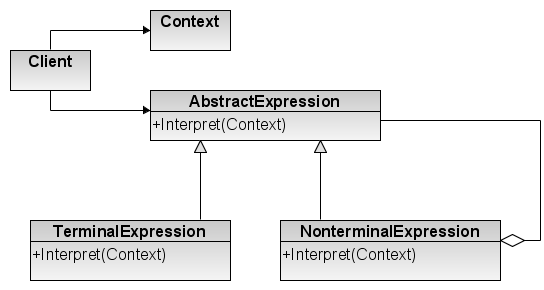

[Retonar a raíz Design-Patterns](https://github.com/julianorinaldi/Design-Patterns)

# Design Pattern - Interpreter

Dada uma linguagem, defina uma representação para sua gramática junto com um intérprete que use a representação para interpretar sentenças na linguagem.

## Diagrama

## Exemplo:

O exemplo construído foi um tradutor.
Dado um texto em qualquer língua, o tradutor irá tentar encontrar sua tradução para outa língua desejada.

- `Contexto` representa a classe `Context`
- `Tradutor` representa a classe AbstractExpression
- `TradutorParaEspanhol`, `TradutorParaFrances`, `TradutorParaIngles` representa a imprementação de cada expressão

