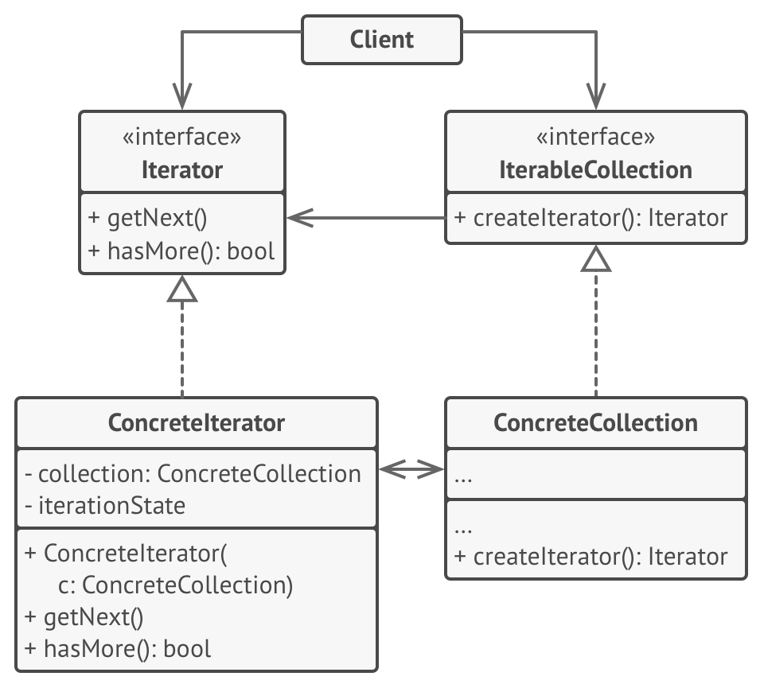

[Retonar a raíz Design-Patterns](https://github.com/julianorinaldi/Design-Patterns)

# Design Pattern - Iterator

A maioria das coleções armazena seus elementos em listas simples. Contudo, alguns deles são baseados em pilhas, árvores, grafos, e outras estruturas complexas de dados.

Mas independente de quão complexa uma coleção é estruturada, ela deve fornecer uma maneira de acessar seus elementos para que outro código possa usá-los. Deve haver uma maneira de ir de elemento em elemento na coleção sem ter que acessar os mesmos elementos repetidamente.

A ideia principal do padrão Iterator é extrair o comportamento de travessia de uma coleção para um objeto separado chamado um iterador.

Se você precisar de uma maneira especial para a travessia de uma coleção, você só precisa criar uma nova classe iterador, sem ter que mudar a coleção ou o cliente.

## Diagrama

## Exemplo

O Iterator foi utilizado para simular a navegação de uma lista de amigos, simulando o facebook.
O objetivo do iterator é pegar o próximo item (se existir) sem se preocupar com a estrutura de dados por trás da colecão.

Em nosso exemplo:
- `IProfileIterator` faz o papel da interface `Iterator`
- `FacebookIterator` faz o papel da classe concreta que implementa o `Iterator`
- `ISocialNetwork` faz o papel do `IterableCollection`
- `Facebook` faz o papel da classe concreta que implementa o `IterableCollection`

Por fim, passamos um `Profile` origem, que seria o perfil que desejamos buscar amigos relacionados.
A classe `Application` faz o papel do `Client`.