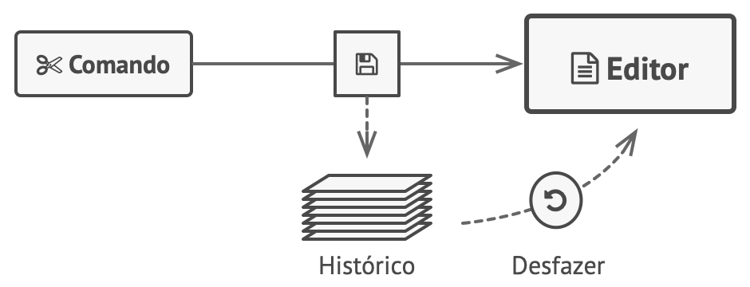

[Retonar a raíz Design-Patterns](https://github.com/julianorinaldi/Design-Patterns)

# Design Pattern - Memento

Permite que você salve e restaure o estado anterior de um objeto sem revelar os detalhes de sua implementação.

O padrão Memento delega a criação dos retratos do estado para o próprio dono do estado, o objeto originador. Portanto, ao invés de outros objetos tentarem copiar o estado do editor “a partir do lado de fora”, a própria classe do editor pode fazer o retrato já que tem acesso total a seu próprio estado.

O padrão sugere armazenar a cópia do estado de um objeto em um objeto especial chamado memento. Os conteúdos de um memento não são acessíveis para qualquer outro objeto exceto aquele que o produziu. Outros objetos podem se comunicar com mementos usando uma interface limitada que pode permitir a recuperação dos metadados do retrato (data de criação, nome a operação efetuada, etc.), mas não ao estado do objeto original contido no retrato.

Utilize o padrão Memento quando você quer produzir retratos do estado de um objeto para ser capaz de restaurar um estado anterior do objeto.

 Permite que você faça cópias completas do estado de um objeto, incluindo campos privados, e armazená-los separadamente do objeto. Embora a maioria das pessoas vão lembrar desse padrão graças ao caso “desfazer”, ele também é indispensável quando se está lidando com transações (isto é, se você precisa reverter uma operação quando se depara com um erro).
## Diagrama

## Exemplo para compreensão

 
No exemplo foi construído um editor de texto apenas para fins didático.

- A classe `Editor` representa o originador, responsável pelo negócio.
- A classe `CommandM` representa o Caretaker ou seja o cuidador.
- A classe `Snapshot` representa o Memento, ou seja o que guarda o estado do objeto anterior.

Para representar o padrão, é colocado um texto no editor, e após alterar o texto, se deseja fazer um "desfazer" para retornar o texto anterior.

Neste caso o memento é muito bem empregado.