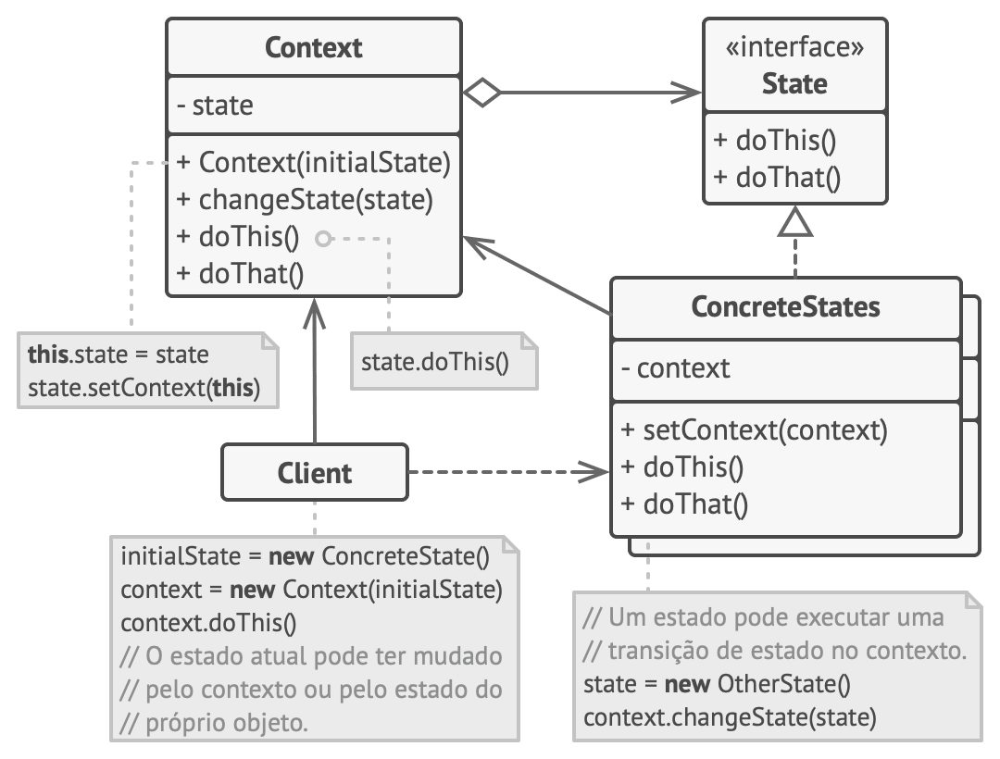

[Retonar a raíz Design-Patterns](https://github.com/julianorinaldi/Design-Patterns)

# Design Pattern - State

Permite que um objeto altere seu comportamento quando seu estado interno muda. 

O padrão State é intimamente relacionado com o conceito de uma Máquina de Estado Finito.

A ideia principal é que, em qualquer dado momento, há um número finito de estados que um programa possa estar. Dentro de qualquer estado único, o programa se comporta de forma diferente, e o programa pode ser trocado de um estado para outro instantaneamente. Contudo, dependendo do estado atual, o programa pode ou não trocar para outros estados. Essas regras de troca, chamadas transições, também são finitas e pré determinadas.

## Diagrama

 Utilize o padrão State quando você tem um objeto que se comporta de maneira diferente dependendo do seu estado atual, quando o número de estados é enorme, e quando o código estado específico muda com frequência.

No exemplo desenvolvido, foi crido uma Arma de Guerra `WarWeapon`, que depende do estado da arma `IWeapon` que se encontra, ela atira de cada jeito.
Foram criados 3 armas: `FireWeapon`, `WatterWeapon` e `Flamethower`.