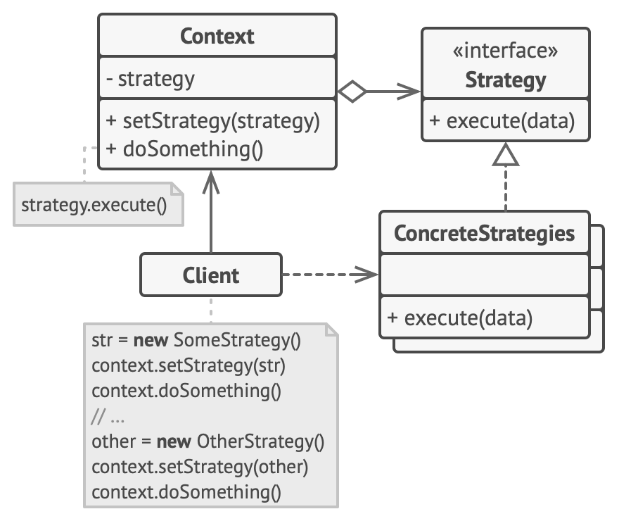

[Retonar a raíz Design-Patterns](https://github.com/julianorinaldi/Design-Patterns)

# Design Pattern - Strategy

Permite que você defina uma família de algoritmos, coloque-os em classes separadas, e faça os objetos deles intercambiáveis.

Sugere que você pegue uma classe que faz algo específico em diversas maneiras diferentes e extraia todos esses algoritmos para classes separadas chamadas estratégias.

## Diagrama

Sem dúvida é o padrão mais utilizado dia a dia. Tão utilizado que muita gente o constrói e nem sabe que ele tem um nome **Strategy**.

Usamos o exemplo mais clássifico possível para representar o padrão. O velho exemplo de entrada de 2 números, e conforme a estratégia, saída de várias formas.

No exemplo, a classe `CalculatorContext` faz o papel do contexto, a interface `ICalculatorStrategy` faz o papel da interface Strategy.

E aí cada implementação do padrão Strategy:
- Soma - `StrategyAddition`
- Subtração - `StrategySubtraction`
- Multiplicação - `StrategyMultiplication`
- Divisão - `StrategyDivision`
- Expoenciação - `StrategyExponentiation`