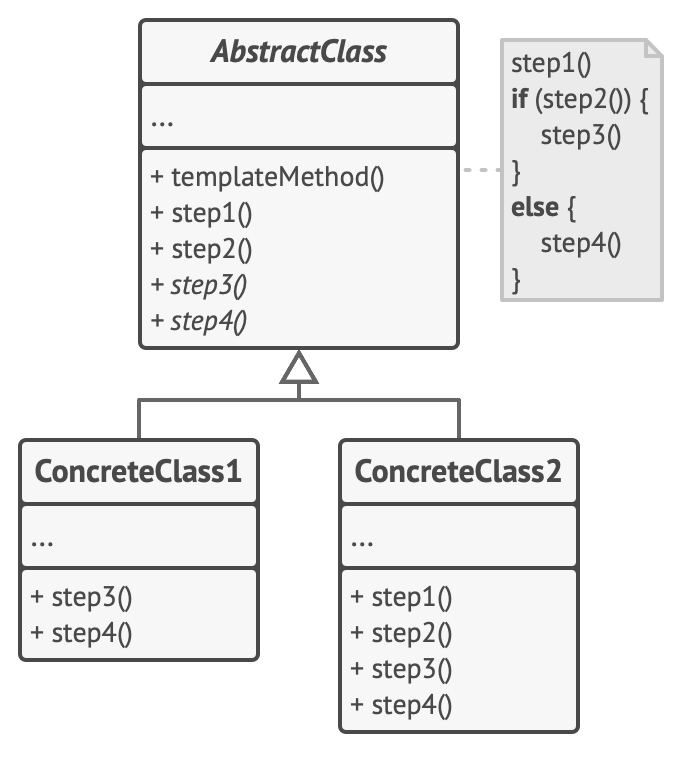

[Retonar a raíz Design-Patterns](https://github.com/julianorinaldi/Design-Patterns)

# Design Pattern - Template Method

Define o esqueleto de um algoritmo na superclasse mas deixa as subclasses sobrescreverem etapas específicas do algoritmo sem modificar sua estrutura.

Sugere que você quebre um algoritmo em uma série de etapas, transforme essas etapas em métodos, e coloque uma série de chamadas para esses métodos dentro de um único método padrão. As etapas podem ser tanto abstratas, ou ter alguma implementação padrão. Para usar o algoritmo, o cliente deve fornecer sua própria subclasse, implementar todas as etapas abstratas, e sobrescrever algumas das opcionais se necessário (mas não o próprio método padrão).

## Diagrama

Foi construído um exemplo levando em conta o padrão Template Method em uma brincadeira de personagem guerreiro.

Neste caso, o Guerreiro classe abstrata `Warrior` define o template que cada personagem Warrior (classes concretas) terão que implementar.
- `WarriorWood` - Classe concreta que herda de `Warrior` e implementa os métodos abstratos.
- `WarriorIron` - Classe concreta que herda de `Warrior` e implementa os métodos abstratos.

Perceba que na classe abstrata `Warrior` contém o método `Fight` que representa o método `TemplateMethod` que faz as chamadas dos métodos abastrados de cada instância de `Warrior`.

