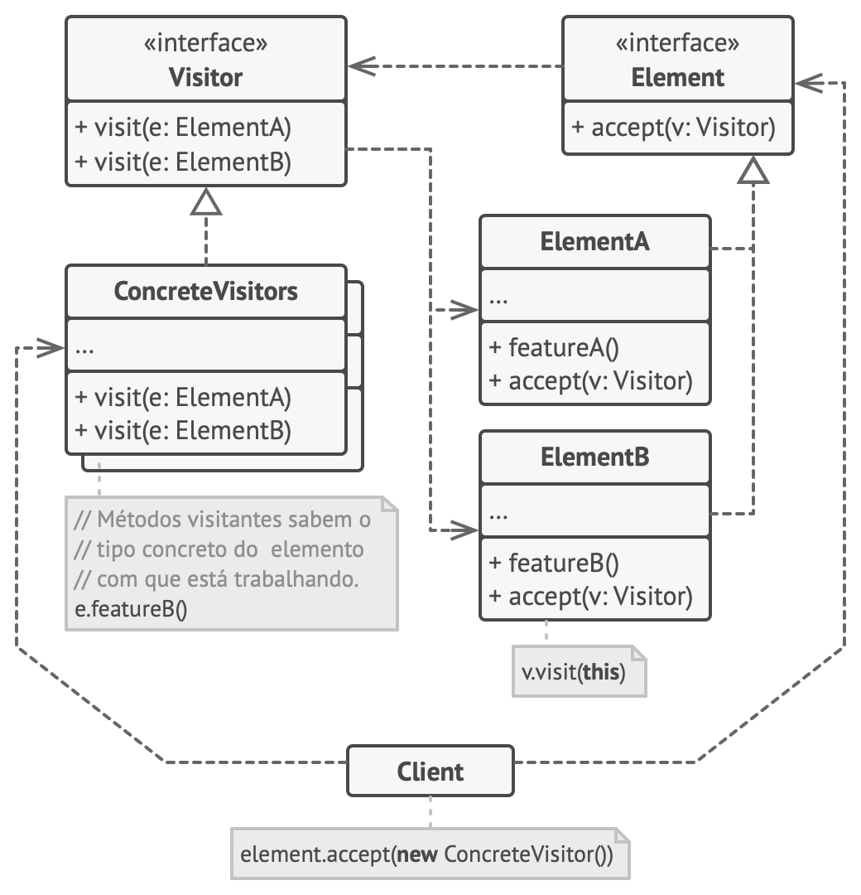

[Retonar a raíz Design-Patterns](https://github.com/julianorinaldi/Design-Patterns)

# Design Pattern - Visitor

Permite que você separe algoritmos dos objetos nos quais eles operam.

Sugere que você coloque o novo comportamento em uma classe separada chamada visitante, ao invés de tentar integrá-lo em classes já existentes. O objeto original que teve que fazer o comportamento é agora passado para um dos métodos da visitante como um argumento, desde que o método acesse todos os dados necessários contidos dentro do objeto.

## Diagrama

O Visitor permite que você adicione operações **externas** para toda uma hierarquia de classe sem mudar o código existente dessas classes.

No exemplo, usamos:
- `IComputerPart` como interface `Element`
- `IComputerPartVisitor` como interface `Visitor` que contém os métodos que se desejam externalizar.
- `Computer`, `Keyboard`, `Monitor`, `Mouse` representam a implementação dos Elementos, e que fazem a chamada para seu método correto no `IComputerPartVisitor`
- `ComputerPartDisplayVisitor` faz o papel do Concrete Visitors, ou seja, onde seria implementado o código externo.