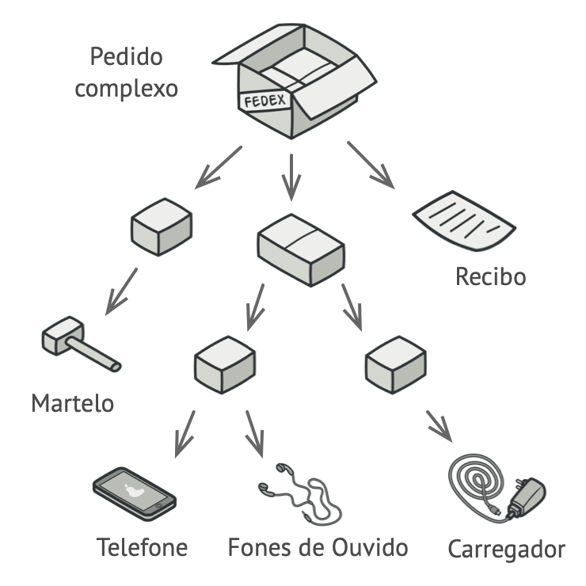
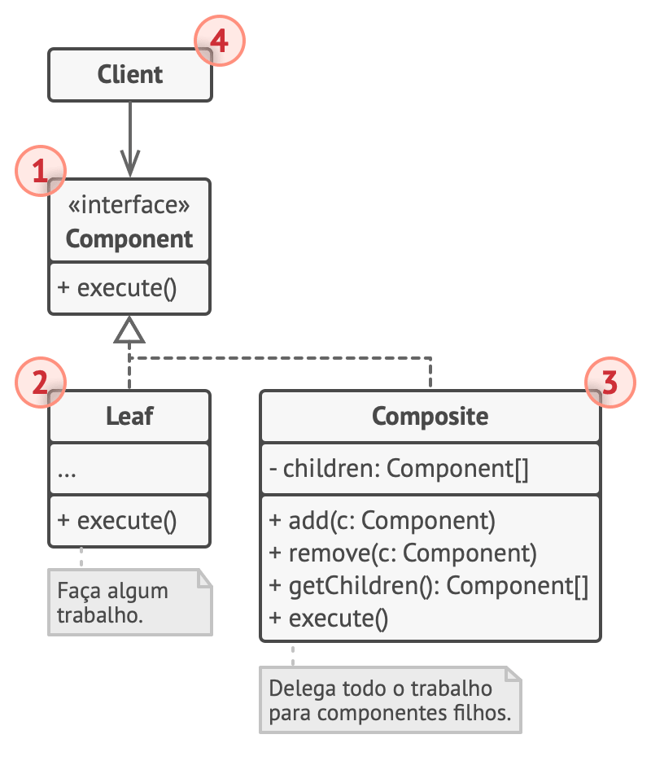

# Design Pattern - Composite

Compor objetos em estruturas de árvores para representar hierarquias de partes inteiras.

Permite que os clientes tratem objetos individuais e composições de objetos de maneira uniforme.

Utilize o padrão Composite quando você tem que implementar uma estrutura de objetos tipo árvore.

O padrão Composite fornece a você com dois tipos básicos de elementos que compartilham uma interface comum: folhas simples e contêineres complexos. Um contêiner pode ser composto tanto de folhas como por outros contêineres. Isso permite a você construir uma estrutura de objetos recursiva aninhada que se assemelha a uma árvore.
___
### Exemplificando

### Diagrama

1. A interface Componente descreve operações que são comuns tanto para elementos simples como para elementos complexos da árvore.

1. A Folha é um elemento básico de uma árvore que não tem sub-elementos.
Geralmente, componentes folha acabam fazendo boa parte do verdadeiro trabalho, uma vez que não tem mais ninguém para delegá-lo.

1. O Contêiner (ou composite) é o elemento que tem sub-elementos: folhas ou outros contêineres. Um contêiner não sabe a classe concreta de seus filhos. Ele trabalha com todos os sub-elementos apenas através da interface componente.
Ao receber um pedido, um contêiner delega o trabalho para seus sub-elementos, processa os resultados intermediários, e então retorna o resultado final para o cliente.

1. O Cliente trabalha com todos os elementos através da interface componente. Como resultado, o cliente pode trabalhar da mesma forma tanto com elementos simples como elementos complexos da árvore.

## Implementação

- `IEstruturaDaArvore` faz o papel do componente ou seja, a interface.
- `Arvore` faz o papel de Container ou Composite, ou seja, possui a adição e remoção de itens, e as chamadas para todos os filhos no método `Criar(...)`.
- `Folha` é a classe final como o próprio nome sugere Leaf, não tem filhas, ela que executa o trabalho que deve ser feito.
- O **Cliente** em nosso caso ficou o Program, a chamada inicial.
