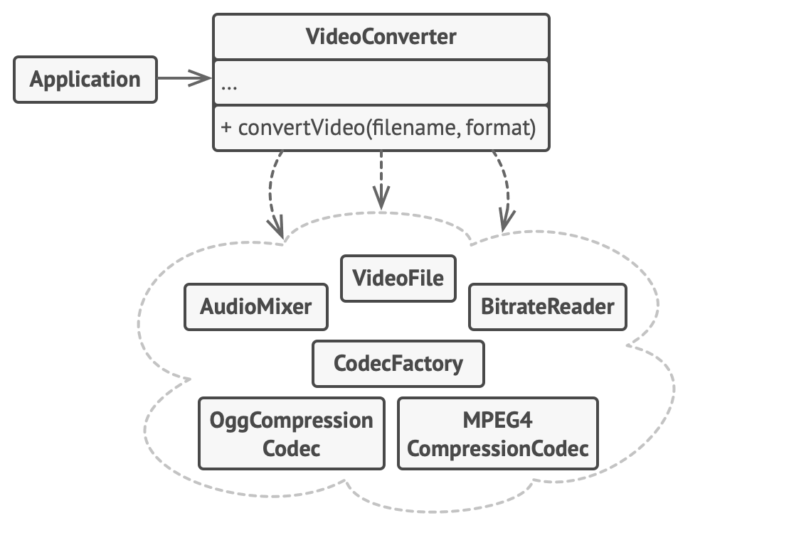

[Retonar a raíz Design-Patterns](https://github.com/julianorinaldi/Design-Patterns)

# Design Pattern - Facade

Agrupa ações de um várias classes em uma única classe.

Objetivo facilitar as ações completas chamando cada método dos seus subsistema centralizado no facade.

## Diagrama

O diagrama exemplo demonstra como o cliente apenas conhece o facade e a partir dele, conhece todos so subsistemas necessários para a execução.

O facade encapsula a instanciação e as chamadas de seus subsistemas, e apenas expõe métodos bem definidos para chamada.

## Exemplo

Para entender vamos usar o exemplo de conversão de vídeo.
- Temos uma classe `VideoConverter` fazendo o papel de **Facade**.
- Temos toda operação desde conversores, tratamento de áudio, arquivos, etc, tudo como subsistemas.
- Quem deseja converter um vídeo, não precisa saber de tudo por trás, mas precisa definir algumas necessidade, como o formato.

Este é um exemplo do facade, onde encapsula seus subsistemas complexos.